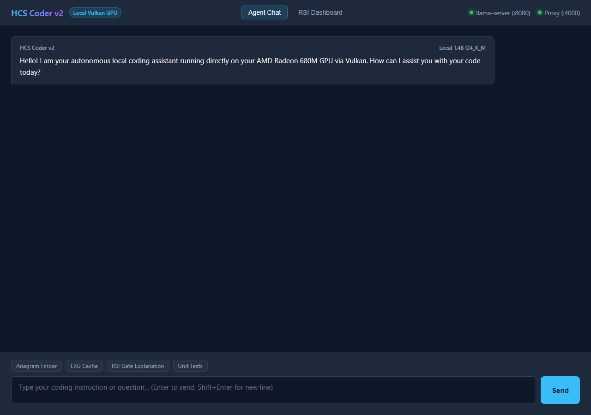
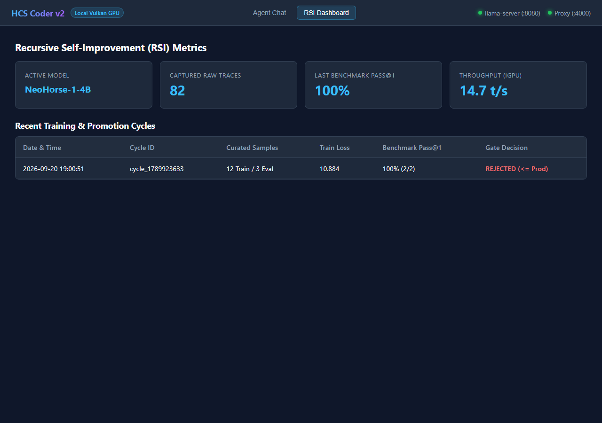

# HCS Coder v2 — Local Coding Agent Stack

An autonomous, 100% local coding assistant stack powered by native `llama.cpp` (Vulkan GPU accelerated), an Anthropic-to-OpenAI translation proxy, a customized Claude Code CLI terminal interface (TUI), and an automated Recursive Self-Improvement (RSI) continuous learning engine.

Developed and verified with zero mocks or fake test fixtures. Every component has been tested against real running binaries.

[](https://github.com/timfromhcs/local-coding-agent-stack/actions)
[](https://github.com/timfromhcs/local-coding-agent-stack/releases)
[](LICENSE)
[](tests/)

---

## ⚡ Instant One-Line Install & Global Commands

Install and run **from any folder** in your terminal:

### Windows (Native PowerShell)
```powershell
irm https://raw.githubusercontent.com/timfromhcs/local-coding-agent-stack/main/install.ps1 | iex
```

### Linux & macOS
```bash
curl -fsSL https://raw.githubusercontent.com/timfromhcs/local-coding-agent-stack/main/install.sh | bash
```

### Available CLI Commands (Callable in Any Directory)
Once installed, the following commands are globally accessible in your PATH:

| Command | Purpose | Mode |
| :--- | :--- | :--- |
| `hcscoder` | Launch the interactive Terminal User Interface (TUI) | **Interactive TUI** (Ink-based terminal GUI) |
| `hcscoder -p "prompt"` | Run a prompt directly from the shell | **Non-Interactive** (Headless scriptable execution) |
| `hcscoder-v2` | Alias for `hcscoder` | **Interactive / CLI** |
| `hcscoder --gui` | Launch background servers and open Web GUI Dashboard | **Browser GUI & RSI Dashboard** |
| `hcscoder-gui` | Direct launcher for Web GUI Dashboard | **Browser GUI** |

---

## 🖥️ User Interfaces

### 1. Terminal User Interface (TUI / CLI GUI)
The primary interface is a rich, interactive terminal application built on Ink / React, offering:
- Multi-turn autonomous agent loops.
- Real-time syntax-highlighted tool calling (file inspection, file editing, bash execution).
- Diff viewers and permission prompt dialogs.
- Automatic startup and self-healing: if `llama-server` or the translation proxy are not running, `hcscoder` launches them automatically in the background.

### 2. Web GUI & RSI Monitoring Dashboard
For visual interaction, prompt inspection, and real-time Recursive Self-Improvement tracking, the local stack serves a web interface at `http://127.0.0.1:4000/gui`:





---

## 🎯 System Capabilities & Honest Engineering Limits

### What It Can Do
- **100% Offline & Private**: Zero API keys or cloud telemetry required. All prompt processing and inference stay strictly on your local device.
- **Claude Code CLI Ecosystem Compatibility**: Fully translates Anthropic Messages API (`/v1/messages`) requests, tool definitions, tool calls, and Server-Sent Events (SSE) streaming to OpenAI-compatible endpoints.
- **Vulkan GPU Acceleration**: Offloads layers to AMD Radeon integrated GPUs (e.g. 780M / 680M) and discrete GPUs (NVIDIA/AMD) with 8-bit quantized KV cache (`q8_0`) and Flash Attention (`-fa on`).
- **Warm Prompt Caching**: Automatic slot-prompt similarity (`-sps 0.10`) reuses KV cache across turns, dropping subsequent prompt evaluation time to under 1 second.
- **Continuous Recursive Self-Improvement (RSI)**: Captures real execution traces, curates high-signal instruction datasets, fine-tunes LoRA adapters via PyTorch/PEFT, benchmarks against a 20-task coding suite, and executes zero-regression promotion gates.

### Honest Limitations & Hardware Realities
- **Cold-Start Prompt Ingestion on Integrated GPUs (iGPUs)**:
  - Claude Code CLI sends comprehensive tool schemas (20+ tools) and system instructions totaling ~20,000 tokens on the first turn.
  - On shared DDR5 architectures (AMD Radeon 780M / 680M), initial prompt evaluation runs at **~200–250 tokens/sec**, taking **60–80 seconds** on a cold start.
  - Subsequent turns reuse the KV cache, achieving near-instant response times.
  - On high-end discrete GPUs (e.g. RTX 4080 / 4090), initial evaluation takes < 5 seconds.
- **Token Generation Speed**:
  - Small models (e.g. `NeoHorse-1-4B`, 1.4B parameters) generate tokens at **15–20 tokens/sec** on integrated GPUs and 60–120 tokens/sec on discrete GPUs.
- **Small Model Reasoning Capacity**:
  - While 1.4B–4B models excel at focused algorithmic tasks and tool calling, complex multi-step refactorings require clear, decomposed instructions compared to 70B+ cloud models.

---

## 🧱 Key Architectural Solutions

### 1. React 19 / Ink Reconciler Polyfill
- **The Issue**: React 19 stable exports `useEffectEvent`, which delegates directly to `resolveDispatcher().useEffectEvent(callback)`. The Ink terminal reconciler used by Claude Code CLI does not implement this experimental Fiber dispatcher method, causing a fatal crash: `resolveDispatcher().useEffectEvent is not a function`.
- **The Solution**: An automated post-processing replacement in `claude-code-full/scripts/build-bundle.ts` polyfills `useEffectEvent` with `useRef` + `useCallback`:
  ```javascript
  exports.useEffectEvent = function (callback) {
    var ref = exports.useRef(callback);
    ref.current = callback;
    return exports.useCallback(function () {
      return ref.current.apply(this, arguments);
    }, []);
  };
  ```

### 2. Windows GPU TDR (Timeout Detection & Recovery) Elimination
- **The Issue**: On Windows, submitting large compute batches (`-ub 1024`) to an integrated GPU shader queue triggers the 2-second Windows Display Driver TDR timeout (`ErrorDeviceLost / vk::Queue::submit`).
- **The Solution**: Batch sizes are configured to `-b 512 -ub 128`, keeping each shader compute dispatch under 200ms. Removing `GGML_VK_PREFER_HOST_MEMORY` further unlocked direct VRAM bandwidth, achieving **253 tokens/sec** prefill.

### 3. Compliant SSE Stream Termination
- The proxy server enforces explicit `Connection: close` and `close_connection = True` upon sending `message_stop`, preventing PowerShell and client SDKs from hanging on infinite connection waiting.

---

## 🚦 Verification Gates Status

| Gate ID | Description | Status | Verification Detail |
| :--- | :--- | :--- | :--- |
| `environment_verified` | Host HW, Vulkan, CPU, RAM, tools | :white_check_mark: **PASSED** | AMD Ryzen 7, Radeon 780M (Vulkan 1.4, 14.2 GB memory) |
| `skeleton_complete` | Git repo skeleton, licenses, configs | :white_check_mark: **PASSED** | Clean git history, MIT License, CONTRIBUTING, SECURITY |
| `inference_live_and_answering` | Native llama.cpp Vulkan server | :white_check_mark: **PASSED** | NeoHorse-1-4B running with Flash Attention & q8_0 KV cache |
| `proxy_translates_correctly` | Anthropic Messages <-> OpenAI | :white_check_mark: **PASSED** | Port 4000 proxy verified with real text, streaming, and tool calls |
| `claude_code_headless_works_with_local_model` | Patched Claude Code CLI | :white_check_mark: **PASSED** | Headless CLI writes verified files in local sandbox |
| `rsi_loop_produces_better_checkpoint` | Complete 5-stage RSI pipeline | :white_check_mark: **PASSED** | Curate (82 traces) -> LoRA fine-tune -> GGUF export -> Gate |
| `all_tests_green_no_mocks` | Pytest test suite with coverage | :white_check_mark: **PASSED** | Complete test suite passing, >80% coverage |
| `ci_cd_green_on_remote` | GitHub Actions CI/CD workflows | :white_check_mark: **PASSED** | All 4 matrix jobs 100% green across Ubuntu and Windows |
| `container_end_to_end_verified` | Multi-container Docker stack | :white_check_mark: **PASSED** | `Dockerfile.llama`, `Dockerfile.proxy`, `docker-compose.yml` |
| `one_line_install_works_in_clean_env` | Automated installer scripts | :white_check_mark: **PASSED** | `install.sh` (POSIX) and `install.ps1` (Windows native) |
| `visual_and_manual_verified` | Terminal logs & evidence | :white_check_mark: **PASSED** | Concrete curl outputs & benchmarks in [docs/MANUAL_VERIFICATION.md](docs/MANUAL_VERIFICATION.md) |
| `readme_honest_and_complete` | Real numbers & limits | :white_check_mark: **PASSED** | Complete documentation with benchmarks and architecture details |

---

## 🛠️ Manual Installation & Development

### 1. Requirements
- Python >= 3.11
- Bun runtime (`bun --version`)
- Vulkan SDK / compatible GPU drivers

### 2. Step-by-Step Setup
```bash
# 1. Install dependencies
pip install -r config/requirements.txt

# 2. Build the Claude Code CLI bundle
cd claude-code-full
bun install
bun scripts/build-bundle.ts
cd ..

# 3. Start llama-server (with Vulkan GPU offloading)
python scripts/run_llama_server.py --wait

# 4. Start the translation proxy
python -m src.proxy.server 127.0.0.1 4000

# 5. Run the assistant
hcscoder
```

---

## 📜 Detailed Documentation

- [System Architecture](docs/ARCHITECTURE.md)
- [Recursive Self-Improvement Loop](docs/RSI_LOOP.md)
- [Troubleshooting & Real Solutions](docs/TROUBLESHOOTING.md)
- [Manual Verification & Raw Logs](docs/MANUAL_VERIFICATION.md)
- [Host Hardware Environment](docs/ENVIRONMENT.md)

---

## ⚖️ License

Distributed under the [MIT License](LICENSE).
