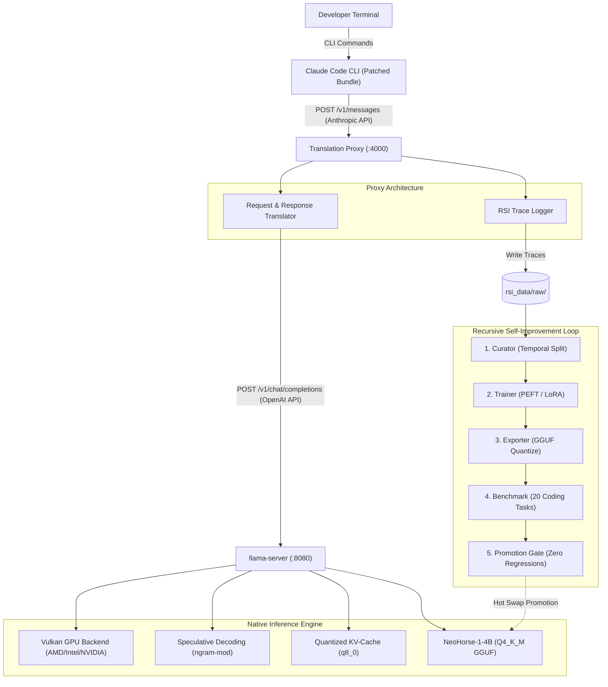

# System Architecture & Technical Specifications

The **Local Coding Agent Stack** delivers an autonomous, offline-first programming assistant running entirely on local consumer hardware without third-party cloud API dependencies.

---

## 1. Components Overview

### A. Claude Code CLI (`claude-code-full/dist/cli.mjs`)
- **Runtime**: Bun / Node.js
- **Upstream Source**: Fully reconstructed from `@anthropic-ai/claude-code` npm distribution.
- **Patches Applied**:
  - `01-base-url.patch`: Respects `ANTHROPIC_BASE_URL` with priority over internal defaults.
  - `02-small-fast-model.patch`: Redirects all utility calls (summarization, categorization, token counting) to the local model.
  - `03-retry-and-timeout.patch`: Extends request timeouts to 180s and enables 5 retries for local prompt evaluation.

### B. Translation Proxy (`src/proxy/server.py`)
- **Port**: 4000
- **Ingress**: Anthropic Messages API (`/v1/messages`, `/v1/messages/count_tokens`, `/v1/models`).
- **Egress**: OpenAI Chat Completions API (`http://127.0.0.1:8080/v1/chat/completions`).
- **Streaming**: Native Server-Sent Events (SSE) translation chunk-by-chunk (`message_start`, `content_block_delta`, `message_stop`).
- **Tool Calling**: Bi-directional transformation between Anthropic `input_schema` and OpenAI JSON schema functions, with fallback JSON extraction for markdown responses.
- **Data Capture**: Every prompt-completion pair is logged to `rsi_data/raw/trace_<timestamp>_<uuid>.json`.

### C. Native Inference Engine (`bin/llama-vulkan/llama-server.exe`)
- **Port**: 8080
- **Binary**: Native MSVC/Clang build of `llama.cpp` (b11064+) with Vulkan compute shader acceleration.
- **Context Window**: 32,768 tokens (`-c 32768`).
- **Memory Optimizations**:
  - Quantized KV-cache (`-ctk q8_0 -ctv q8_0`) reducing KV memory pressure by 50%.
  - Flash Attention (`-fa on`) for low-memory quadratic attention scaling.
  - Speculative Decoding (`--spec-type ngram-mod`) for accelerated token generation.

### D. Recursive Self-Improvement (RSI) Daemon (`src/rsi/daemon.py`)
- Continuous or scheduled background process executing 5-stage improvement cycles:
  1. **Curate**: Filter raw traces into temporally split `train.jsonl` (80%) and `eval.jsonl` (20%).
  2. **Train**: LoRA fine-tuning using PyTorch and Hugging Face `peft`.
  3. **Export**: Checkpoint packaging and GGUF quantization via `llama-quantize`.
  4. **Benchmark**: Standardized 20-task unit-tested coding benchmark measuring pass@1 and throughput.
  5. **Promoter**: Strict promotion gate requiring higher pass@1, zero core task regressions, and <10% latency regression.

---

## 2. Network & Port Allocations

| Service | Protocol | Host / Port | Target / Purpose |
| :--- | :--- | :--- | :--- |
| **Inference Server** | HTTP / JSON | `127.0.0.1:8080` | Native llama.cpp OpenAI-compatible endpoint |
| **API Proxy** | HTTP / SSE | `127.0.0.1:4000` | Anthropic Messages API translation layer |
| **Claude Code CLI** | CLI / Stdio | Local Process | Headless & interactive coding agent |
| **RSI Daemon** | Background Service | Local Subprocess | 24h recursive improvement loop |
