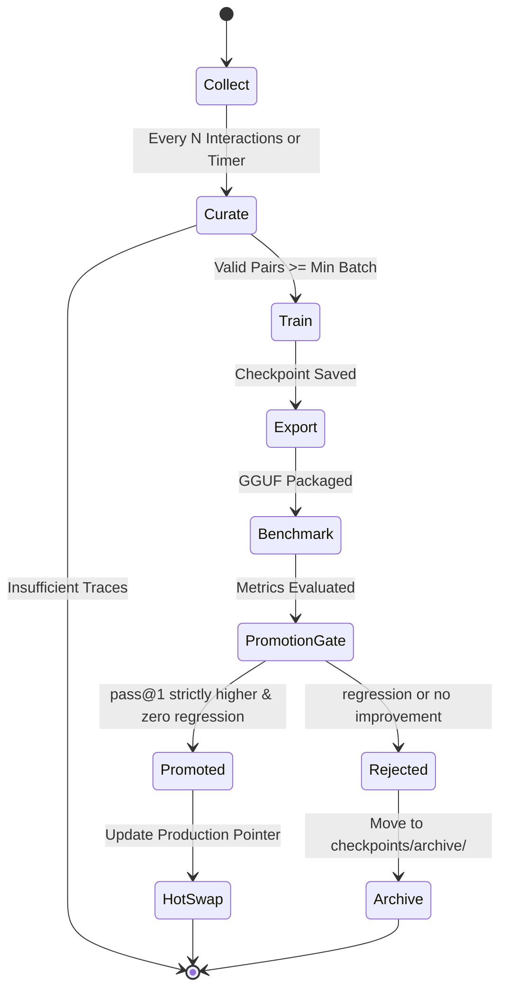

# Recursive Self-Improvement (RSI) Loop

The RSI Loop is a fully automated, continuous learning pipeline that captures real agent interactions, curates high-signal training pairs, fine-tunes parameter-efficient adapters, quantizes checkpoints, and subjects candidates to a strict promotion gate.



---

## 1. Stage Specifications

### Stage 1: Collect (`src/proxy/server.py`)
- Automatically intercepts all incoming requests to `/v1/messages` and outgoing responses.
- Saves interactions to `rsi_data/raw/trace_<timestamp>_<uuid>.json` containing:
  - `timestamp`: Epoch seconds
  - `latency_ms`: Total roundtrip time in milliseconds
  - `success`: Boolean indicating successful completion or error
  - `request`: Full Anthropic request payload (system prompts, messages, tool definitions)
  - `response`: Full Anthropic response payload (text content, tool calls, token usage)

### Stage 2: Curate (`src/rsi/curator.py`)
- Filters noisy or trivial samples:
  - Discards failed requests (`success == False`).
  - Requires non-empty response content with either substantive reasoning/code or valid tool invocations.
- Converts raw traces into ChatML instruction-tuning format:
  ```json
  {
    "timestamp": 1789918439.36,
    "instruction": "<|im_start|>system\n...<|im_end|>\n<|im_start|>user\n...<|im_end|>\n<|im_start|>assistant\n",
    "response": "...<|im_end|>"
  }
  ```
- **Temporal Holdout**: The most recent 20% of data is reserved strictly for evaluation (`eval.jsonl`), preventing data leakage.

### Stage 3: Train (`src/rsi/trainer.py`)
- Implemented with **PyTorch** and Hugging Face **PEFT** (LoRA).
- LoRA Configuration:
  - Rank ($r$): 8
  - Alpha ($\alpha$): 16
  - Dropout: 0.05
  - Target Modules: Attention projection layers (`c_attn`, `q_proj`, `v_proj`)
- Saves checkpoint directory containing:
  - `adapter_model.safetensors`
  - `adapter_config.json`
  - `training_meta.json` (loss history, timestamps, sample counts, duration)

### Stage 4: Export (`src/rsi/export.py`)
- Packages fine-tuned checkpoint metadata.
- Integrates with `llama.cpp` quantization tools (`llama-quantize.exe`) to produce `Q4_K_M` or `Q8_0` GGUF artifacts.

### Stage 5: Benchmark (`src/rsi/benchmark.py`)
- Standardized suite of 20 unit-tested coding tasks across 7 domains:
  - Algorithms (Fibonacci, Binary Search, Merge Intervals, etc.)
  - Data Structures (Two Sum, Valid Parentheses, Top K Frequent)
  - Strings (Reverse Words, Longest Common Prefix, Group Anagrams)
  - Dynamic Programming (Coin Change, Climb Stairs)
  - Graphs & Recursion (Count Islands, Flatten List)
  - Math & Stacks (Reverse Polish Notation, Matrix Transpose)
- Measures:
  - `pass@1`: Percentage of tasks passing all unit test assertions.
  - `mean_latency_ms`: Average inference latency per task.
  - `avg_tokens_per_sec`: Token generation throughput.

### Stage 6: Promotion Gate (`src/rsi/promoter.py`)
Candidates are promoted to production **ONLY IF**:
1. `candidate_pass_rate > production_pass_rate` (strictly higher, not equal).
2. **Zero Regression**: Every individual task that passed in production must also pass in the candidate.
3. **Latency Regression < 10%**: `candidate_mean_latency <= production_mean_latency * 1.10`.

If passed: Updates `current_production.gguf` and hot-swaps model slots.  
If failed: Checkpoint is safely archived in `checkpoints/archive/rejected_<timestamp>/` with recorded reasons.

---

## 2. CLI Dashboard & Monitoring

Query real-time RSI status:
```bash
python -m src.rsi.daemon status
```

Output:
```text
============================================================
       RSI (RECURSIVE SELF-IMPROVEMENT) DASHBOARD
============================================================
 Status:                  IDLE
 Current Model:           NeoHorse-1-4B.Q4_K_M.gguf
 Total Raw Traces:        82
 Total Cycles Run:        1
 Total Model Promotions:  0
 Last Benchmark Pass@1:   100.0%
------------------------------------------------------------
 Recent Cycles:
  [2026-09-20 19:00:51] cycle_1789923633 | Samples: 12 | Loss: 10.884 | Pass@1: 100% | REJECTED
============================================================
```
